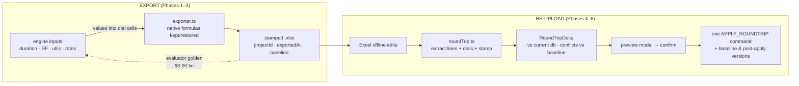

# Excel Round-Trip — Plan of Record
_2026-06-12 · status: ACTIVE — Phases 1–6 + the Phase 7 code-review pass SHIPPED
2026-06-12 (PR #3); flip to SHIPPED after the architect-machine items in
`docs/handoffs/2026-06-12-excel-roundtrip-closure.md` (calibration golden, real-Excel
round-trip incl. stamp survival, local build)_

## Context

Excel is currently a one-way, partially-dead export: `src/lib/exporter.ts` writes STEP 2/3
line quantities and section subtotals as frozen values (`writeStep23SheetDetail`,
`STEP23_SUBTOTAL_CELLS`), and overwrites the STEP 4 linked-row pulls with values — so
changing a dial offline recalculates nothing. There is also no way back: offline edits
must be retyped into the app. This plan makes the exported workbook a live, verified
projection of the app (dials in, native template formulas recomputing), and adds a
re-upload path with a delta preview, one-command undo, and automatic versioning. Business
driver: app adoption — Excel becomes the app's offline viewport, not its competitor.
Export ships first.

Forensic ground truth (verified this session against the committed
`templates/Company_Estimate_Template.xlsx`):
- Dials: STEP 2/3 `$J$5` = duration ← `'STEP 1'!D28` (= `YEARFRAC(D10,D11)*12`);
  `$J$8` = square footage ← `'STEP 1'!D12` (STEP 3's J8 routes via STEP 4 K8).
- Native patterns: staffing `F = $J$5*4.33*E*40`, `I = F*H`; qty patterns `=$J$5`
  (monthly), `=$J$5*4` (weekly), `=J8/3000` (per-SF); section subtotals `SUM(...)`;
  STEP 4 rows 12–24 col H pull STEP 2/3 subtotal cells; col-S checks are exact-equality
  cross-sheet comparisons. Engine equivalence: `HOURS_PER_MONTH = 173.2 = 4.33×40`,
  `computePersonnelCosts`/`computeSiteOperations` mirror these shapes.
- ⚠ The exporter writes STEP 1 D10/D11 as **text**, which would break `YEARFRAC`; and
  `YEARFRAC×12` ≠ the engine's `getMonthsBetween` anyway. D28 must become a **value**
  (the engine's `durationMonths`) — it stays THE editable duration dial.
- `scripts/probe-step23-formulas.cjs` was regenerated in-repo at Phase 1 (the
  architect's original lived untracked on the local machine; the 2026-06-11 CARE
  probe it produced: STEP 2 40 formula rows vs 7 value-only; STEP 3 34 vs 16).
  The committed version expands shared formulas and classifies the full pattern
  grammar; run it against any workbook with `node scripts/probe-step23-formulas.cjs [path]`.

## Goal

An estimator exports an estimate; opening it in Excel and changing duration, square
footage, a utilization, or a rate recalculates STEP 2/3 → STEP 4 correctly with the
template's own check columns tying. They edit offline, re-upload into the same project,
review a delta preview of exactly what changed (lines AND dials, with staleness
conflicts flagged), confirm — and the changes land as one undoable command plus
auto-created estimate versions. Cost history never moves until a human clicks Submit.

## Out of scope / deferred
- **Imported-bid round-trip / reactivation (import roadmap item 2).** `assertNotImported`
  stays untouched on every export path. But item 2 is the **named second consumer** of
  this plan's modules (formula-pattern classification, dial extraction, delta engine,
  apply command) — design their interfaces accordingly. Note for the record: finding
  G-2 is outdated — the 2026-06-11 CARE probe showed most STEP 2/3 dollar rows ARE
  formula-driven with recoverable dials.
- **Budget Line Items sheet stays frozen values** (deliberate gc-siteops Phase 3
  decision: no live SUMIF can produce a wrong rollup). Re-upload ignores the BLI sheet.
- **Re-upload of overridden summary blocks as formula state** — when estimator overrides
  are active the exported summary block stays values (INV-1 behavior unchanged).
- **No DDL.** Stamping lives in the workbook; versions/snapshots tables already exist;
  dial write-back uses existing `project_estimates` JSONB + `projects` columns. If any
  phase discovers a needed schema change, it stops at the approval gate.

## Locked decisions (architect, 2026-06-12)
1. **Fully live chain.** Driver inputs as values (E utilization, H rates, manual F/H,
   STEP 1 D28 duration value); everything computed keeps/restores native formulas —
   line qty patterns, `I=F×H`, section SUMs, STEP 4 linked-row pulls. Check columns
   stay native and tie by construction. Frozen exceptions: BLI sheet, the 2 hand-typed
   %-of-estimate GC lines (template's own circularity break), override-active summary.
2. **Versions per upload: post-apply + safety baseline.** If the working copy isn't
   already captured by the newest version, auto-create "Pre-upload baseline" first;
   then apply and auto-create a version of the result titled from filename/date.
   Neither is submitted.
3. **Staleness: warn + flag.** Export is stamped (project id, exportedAt, compact
   baseline snapshot). Preview always diffs vs CURRENT db state; if the db moved since
   export, show a staleness banner and three-way-flag conflicted rows/dials
   (exported vs Excel vs current); confirm requires acknowledging flags. Never blocks,
   never silent.
4. **Recalc proof: scoped in-repo evaluator + Excel calibration.** Test-side evaluator
   covering exactly the emitted/kept grammar (arithmetic, SUM, SUMIF, IF, ISNUMBER,
   cross-sheet refs), failing loudly on anything else. CI backbone: synthetic-input
   golden + "turn the duration dial and re-tie to $0.00". Calibration golden
   (local-only, skipIf like CARE/McKenna): run the evaluator over the real fixture
   workbooks and compare to Excel's own cached formula results — proves evaluator
   semantics match genuine Excel, so emitter and evaluator can't share a blind spot.
   No LibreOffice, no new dependencies.
5. **Re-upload scope: lines + dials.** STEP 4 line edits AND STEP 2/3 driver inputs
   (utilizations, rates, manual qty/lump sums, duration) map back to
   `gc_utilization` / `gc_equipment_overrides` / `site_ops_quantities` /
   `site_ops_rates` / project fields. Computed cells are never read back — the engine
   recomputes and the tie-out gate proves agreement.
6. **App-born projects only**; modules built pure and reusable for item 2.
7. (Minor, flagged for Phase 5 kickoff review) Duration dial edits reverse-map by
   anchoring `expectedStart` and recomputing `expectedFinish`; the derived date change
   is shown in the preview.

## Shape of the change

## Phases

### Phase 1 — Forensic driver map + pattern module
- **Scope:** Commit this plan to `docs/plans/`; commit `scripts/probe-step23-formulas.cjs`
  (ask the architect for the local untracked copy first; regenerate from the committed
  template only if unavailable). Build `src/lib/step23FormulaPatterns.ts`: a typed,
  per-line classification for every STEP 2/3 line in `constants.ts`
  (STAFF/OPERATIONAL/EQUIPMENT/GC_MANUAL/SITE_OPS_* defaults) — which cells are
  estimator inputs (values), which carry which native formula pattern, keyed by the
  line's col-C code. This is the shared interface item 2 will consume.
- **Tests:** a CI-safe sync test proving the pattern map matches the committed
  template's actual formulas (same spirit as `template-layout-sync.test.ts`).
- **Exit:** `npm run test` green · `npx tsc --noEmit` clean · committed · handoff
  (`/handoff`). No exporter behavior change yet.

### Phase 2 — Live export
- **Scope:** `exporter.ts` only. `writeStep23SheetDetail` consumes the pattern map:
  write input cells as values; **stop overwriting** native qty formulas and the
  section-subtotal SUMs (drop the `STEP23_SUBTOTAL_CELLS` value pass + its guard).
  STEP 4 linked rows: restore native pull formulas (`F=1`, H = the STEP 2/3 subtotal
  ref) instead of values. STEP 1: D28 = engine `durationMonths` as a value; keep
  D10/D11 writes but they no longer feed math. Override-active path unchanged
  (summary block frozen). Ascending-column-order rule holds on every row write.
- **Tests:** update `exporter.test.ts`, `export-integrity.test.ts`,
  `full-export-corruption.test.ts` for the new shapes; all existing goldens
  (synthetic CI + McKenna/CARE local) still tie $0.00.
- **Exit:** suite green · tsc clean · committed · handoff.

### Phase 3 — Recalc evaluator + goldens
- **Scope:** `src/lib/formulaEvaluator.ts` (pure; reusable by item 2): evaluates the
  supported grammar over a workbook cell graph (reuse `parseCellRef`/col helpers from
  `exportUtils`/exporter), loud failure on unsupported constructs.
- **Tests:** (a) CI golden `src/__tests__/golden-roundtrip-recalc.test.ts`: synthetic
  inputs → `generateExcelWorkbook` → evaluate → every STEP 2/3 line, subtotal, STEP 4
  linked row, modifier, grand total ties the engine at `RECONCILIATION_TOLERANCE`;
  (b) dial-turn test: change duration/SF/a utilization/a rate in the model,
  re-evaluate, tie against the engine recomputed with the same inputs; (c) local-only
  calibration golden over the real fixtures' cached Excel values (skipIf absent).
- **Exit:** suite green · tsc clean · committed · handoff. **Export half done.**

### Phase 4 — Export stamp + round-trip extraction/delta engine (pure)
- **Scope:** Exporter adds a stamp: custom workbook part with projectId, exportedAt,
  and a compact baseline snapshot (rows' itemId/desc/qty/price + dial values) so the
  three-way diff needs no db lookup. New `src/lib/roundTrip.ts`: read stamp; extract
  STEP 4 lines (reuse `templateExtractor` machinery) + STEP 2/3 dials (via the pattern
  map — read input cells, never computed ones); produce `RoundTripDelta`
  (changed/added/removed rows matched by itemId, dial changes, project-field changes,
  conflicts vs baseline). Wrong-project / unstamped / imported-project ⇒ typed errors.
- **Tests:** synthetic export → simulated Excel edits (XML mutation incl. stale cached
  values) → extract → delta correctness + conflict flagging; tie-out check that
  re-extracted inputs re-derive the workbook's cached totals within tolerance.
- **Exit:** suite green · tsc clean · committed · handoff.

### Phase 5 — Apply command + automatic versions
- **Scope:** New `ApplyRoundTripCommand` in `src/types/index.ts` (row prev/next states
  + appended/removed rows, mirroring `MergeTakeoffDataCommand`, **plus** dial prev/next:
  gc utilization/equipment/manual, site-ops quantities/rates, project fields).
  Dispatch in `useCommandDispatch`; dial setters exposed from
  `usePersonnelCalculations`/`useInfrastructureCalculations`. One `pushCommand`, one
  Ctrl+Z. Auto-versions per locked decision 2 via existing `createEstimateVersion`
  (db.ts); persistence rides the existing save path; `source` provenance preserved on
  every row (`MERGE`-style prev/next capture).
- **Approval gates:** none expected (no DDL) — ⛔ stop if one appears.
- **Exit:** suite green (incl. undo-fidelity tests in the import-integrity style) ·
  tsc clean · committed · handoff.

### Phase 6 — Re-upload UI
- **Scope:** Upload entry in the workspace data-I/O action bar (app-born projects
  only); `RoundTripPreviewModal` (patterns from `ImportPreviewModal` +
  `VersionsPanel`/`versionDiff` rendering): line deltas, dial deltas, summary delta,
  staleness banner + conflict acknowledgment; confirm → Phase 5 apply. Clear error
  surfaces for unstamped/wrong-project/imported workbooks.
- **Exit:** suite green · tsc clean · `npm run build` green · committed · handoff.

### Phase 7 — Hardening + closure
- **Scope:** End-to-end manual verification (`/verify`): real export → Excel edit →
  re-upload → undo → versions; edge cases (rows deleted/inserted in Excel, file saved
  by non-Excel tools, repeated uploads); `/code-review`; plan flipped to SHIPPED;
  closure handoff.
- **Exit:** full suite + tsc + build green · architect sign-off on the live workbook.

## Risks & unknowns
- **Per-line formula audit surprises** (Phase 1 finds them): lines whose template shape
  doesn't match the engine driver exactly (e.g. superintendent-driven rows
  `F=$J$5*E37`, the weekly `×4` vs engine's monthly basis). Each mismatch is surfaced
  in the Phase 1 findings table for sign-off — never silently reconciled (AGENTS.md).
- **Float-order drift**: live SUMs recompute in sheet order vs engine order; all ties
  are at the existing $0.01 tolerance, and the evaluator golden measures it (Phase 3
  finds out).
- **Excel's own behaviors** (cached-value staleness, inserted rows breaking ranges):
  Phase 4's simulated-edit tests + Phase 7 manual verification find out.
- **Remote/CI environments lack the confidential fixtures** — every new golden must be
  CI-safe via the committed template + synthetic inputs, with local-only extensions.

## Phase 1 findings — engine↔template divergences (signed off 2026-06-12)

Full probe of the committed template (every code-bearing STEP 2/3 row, E/F/H/I):
STEP 2 — 24 qty cells formula-driven, 11 input; STEP 3 — 3 formula-driven, 38 input.
Reconciliation rule: every qty-area cell is either an app INPUT (written as a value,
editable, read back) or app-COMPUTED (template-grammar formula over app inputs).
Where the blank template's native shape disagrees with the engine's driver model,
the engine wins, expressed only in template-native patterns. Encoded in
`src/lib/step23FormulaPatterns.ts`; pinned by `step23-formula-patterns-sync.test.ts`.

| # | Line(s) | Template native | Engine driver | Disposition (architect) |
|---|---------|-----------------|---------------|--------------------------|
| A | Small Tools `01-1000.001` (S2 r36) | `=$J$5` (monthly) | duration × su utilization | Emit `=$J$5*E36` (the Fuel-row superQty pattern), E36 = su utilization value — live on both dials |
| B | Dumpsters `01-5130.001` (r47 `=$J$5*4`), Temp Toilets `01-5140.001` (r48 `=$J$5`), Temp Electric `01-5170.001` (r51 `=$J$5`) | rate × duration formulas | typed lump-sum total (`gc_equipment_overrides`) | Input cells (F=0/1, H=amount) — honest to the app's input model; not duration-driven |
| C | Safety `02-9015.001` (S3 r17), Material Hoist `02-9405.001` (r65) | typed input F | auto qty = duration months | Emit `=$J$5` (monthly pattern), H = rate value — recalcs with duration like every other monthly line |
| D | Progress Cleaning Payroll/Hired `02-9010.001/.002` (S3 r15–16) | `=$J$5*4.33*E*40` (staffHours) | typed hours qty × fixed rate | Write F as the typed hours VALUE (overwrites native formula) — no synthetic back-derived utilization |
| — | Safety Consultant `01-0610.001` (r35), Procore `01-1600.001` (r39) | typed inputs (+ native `H39==H35`) | typed lump-sum amount | Frozen template-faithful values F=pct, H=basis (locked decision 1 — circularity break) |

Additional native facts encoded: Temp Protection `02-9020.001` (S3 r18) natively `=J8`
(sqft pattern) — matches the engine's squareFootage driver, kept live. STEP 4 linked
rows 12–24: native `F=1`, `H='STEP 2/3'!I<subtotal>`, `I=IF(ISNUMBER(F),F*H,0)`,
col-S exact-equality checks — Phase 2 restores these pulls. STEP 3 section subtotals:
`I29/I35/I40/I45/I51/I62/I72/I82 = SUM(...)`; STEP 2: `I16`, `I58`.

## Phase 1 kickoff prompt
> Read `docs/plans/2026-06-12-excel-roundtrip.md` (Excel Round-Trip plan of record) and
> `docs/plans/2026-06-05-gc-siteops-phase1-findings.md`. Execute **Phase 1 only**:
> commit the probe script `scripts/probe-step23-formulas.cjs` (I have the untracked
> copy locally), build `src/lib/step23FormulaPatterns.ts` per the plan, with the
> CI-safe template-sync test. Surface any line whose template formula shape does not
> match its engine driver in a findings table and STOP for my sign-off before encoding
> it. Exit: `npm run test` green, `npx tsc --noEmit` clean, committed, then close with
> `/handoff`. Do not start Phase 2.
